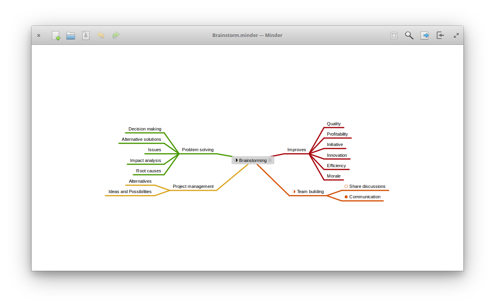

# Minder

  

## Installation

You will need the following dependencies to build Minder:

* meson
* valac
* debhelper
* libcairo2-dev
* libgranite-dev
* libgtk-3-dev
* libxml2-dev
* libgee-0.8-dev

From the command-line within the top Minder directory, run `./app run` to build and run the application.

To install, run `sudo ./app install` and then run the application from your application launcher.

## Quick Guide to Creating a Mind-Map

When the application is first launched, a main idea node will be displayed in the center of the mind-map canvas. The following actions can be performed on this node:

| Key/Mouse Action | Description |
|------------------|-------------|
| e | Edits the displayed node text (otherwise called the node "name") of the currently selected node. Editable text will be immediately highlighted, so just start typing the new name to change it. To end the text editing, hit either the **Return** key or the **Tab** key. |
| f | Folds the currently selected node, hiding the selected node's tree. |
| z | Zooms out. |
| Z | Zooms in. |
| m | Selects the root node of the current tree. |
| C | Centers the currently selected node in the canvas. |
| Cursor keys | changes the selection to the node in the given direction. |
| Tab | Adds a new child node to the currently selected node. The new node will be immediately editable. |
| Return | Adds a new sibling node of the currently selected node. The new node will be immediately editable. |
| Control-n | Creates a new mind map document. |
| Control-o | Opens an existing document. |
| Control-s | Saves the current state of the document. |
| Control-S | Saves the current mind-map to a specified file. |
| Control-f | Opens the search popover. Entering a string will find all nodes with names that match the strings. Selecting a node in the list will select and bring the node into view on the canvas. |
| Control-z | Undoes the last change. |
| Control-Z | Redoes the last undo change. |
| Right mouse click | Displays a contextual menu listing the available actions that can be taken. |
| Click and drag onto empty space | Moves the selected node to a new position in the selected node's parent. |
| Click and drag onto another node | Detaches the dragged node and attaches it to the node that is dragged over. |

## Property Sidebar

The property sidebar can be shown or hidden by clicking on the gear icon in the upper right corner of the window. This sidebar contains two tabs, one for editing or taking action on the currently selected node. The other tab allows you to modify the layout or theme that is used for the entire mind map.

  

