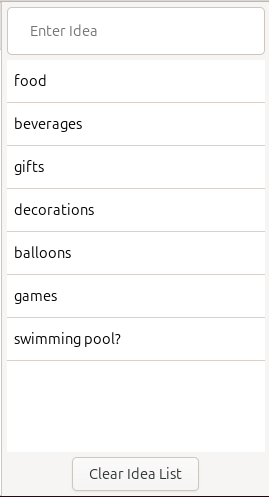

# Brainstorming

Sometimes it can be useful, when mind mapping, to just enter a bunch of ideas without worrying about how it relates to other items in the mindmap. This is where the brainstorming feature of Minder can help you get those ideas down before they disappear and then figure out where those ideas go in the mind map itself at a later date.

### Adding Ideas

The brainstorming interface can be shown or hidden by clicking on the lightbulb icon in the header. Once displayed, the entry field will be given keyboard focus allowing you to start entering your ideas. After an idea has been entered, hit the **Enter** key to add the idea to the list of ideas below. The entry field will then be cleared and given the keyboard focus to allow you to continue entering ideas quickly and efficiently. The ideas added to the brainstorming interface are saved to the .minder file, allowing you to keep this list of ideas around for the lifetime of the mind map itself.

### Removing Ideas

To remove an idea from the brainstorm interface, simply select the idea in the list and hit the **Delete** or **Backspace** key.

If you want to quickly remove all ideas from the brainstorming list, click the **Clear Idea List** button at the bottom of the panel.

### Moving Ideas Into The Mindmap

When you are ready to move an idea into the mind map, simply drag and drop the idea from the brainstorm list onto a node in the mind map.  You can also make an idea a root node in the mind map by dragging and dropping the idea into an unoccupied area of the mind map. Note that once ideas are moved into the mind map, they are removed from the brainstorming list and cannot be moved back.

