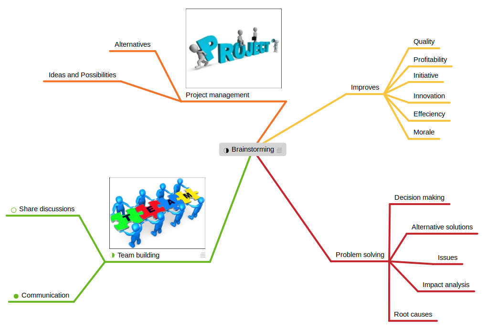

# Mindmap Canvas

This is the main area below the header bar where the user can create, edit, view and rearrange mind map nodes.

The following is a representation of this area.

### Navigating the Canvas

* To pan the contents of the canvas, hold down the Alt key while moving the mouse cursor.
* To scroll up/down with a mouse, use the scrollwheel.  To scroll left/right with a mouse, hold down the Shift key while using the scrollwheel.
* To draw a selection box around nodes, click anywhere on the canvas that is not occupied by an element and press the left mouse button while moving the mouse cursor.
* To select a node, simply click on any node in the canvas. This will cause the node to be drawn with a selection around the entire node's contents and will make this node the "current" node. Any actions selected in the contextual menu will be applied to this node. To deselect the node, simply click on any space in the canvas not occupied by a node.
* To edit the text within a node, double click on the text area of the node. This will cause the entire text of the node to be selected and the cursor will be drawn.

### Editing Node Text

* When node text is in edit mode (by double-clicking on the node text in the canvas), all text will be selected, allowing you to start entering new text for the node.

### Canvas Contextual Menu

By right-clicking anywhere in the canvas, you can bring up a contextual menu that provides an extensive list of functionality to use within the canvas.

The following table summarizes each option in this menu.

| Option |  Description |
|--------|--------------|
| Copy | Copies the currently selected node and its descendants. |
| Cut | Copies the currently selected node and its descendants and deletes them from the canvas. |
| Paste | Copies previously copied node tree as a child of the currently selected node. |
| Paste and Replace Node | Copies previously copied node tree, replacing the current node with the root node of the copied tree. |
| Delete | Removes the currently selected node and its descendants from the canvas. |
| Delete Single Node | Removes only the currently selected node.  If the removed node contains children, these children will become children of the removed node's parent. |
| Change Node ‣ Edit Text | Changes the mode of the currently selected node to text edit mode. |
| Change Node ‣ Edit Note | Places keyboard focus in the note field of the sidebar (displays the note field of the currently selected node if it is not displayed). |
| Change Node ‣ Edit Tags | Displays the tag panel in the sidebar for the currently selected node. |
| Change Node ‣ Add Task | This item will be displayed if the currently selected node is not already a task. Selecting this option will make the current node a task and will cause all parent nodes to display node tasks under them. |
| Change Node ‣ Remove Task | This item will be displayed if the currently selected node is already a task. Selecting this option will remove the task identifier from the current node and adjust all parent nodes accordingly. |
| Change Node ‣ Add Image | This item is displayed if the currently selected node does not have an image associated with it. Displays an open file dialog to allow you to select any image from the file system to associate with the currently selected node. |
| Change Node ‣ Remove Image | This item is displayed if the currently selected node already has an image associated with it. Selecting this option will remove the image from the current node. |
| Change Node ‣ Remove Sticker | Only available if a sticker is associated with the currently selected node.  Removes the sticker if selected. |
| Change Node ‣ Add Node Link | Adds a link to another node in the current mind map or another mind map.  See [[Node-Links]] for details. |
| Change Node ‣ Add Connection | Creates a new connection that uses the currently selected node as a source.  Use the keyboard to traverse the tree to select the node to connect to and click the **Return** key to complete the connection.  See [[Adding-Connections]] for details. |
| Change Node ‣ Add Group | Creates a new group for the currently selected node and all its descendants.  See [[Adding-Node-Groups]] for details. |
| Change Node ‣ Add Callout | Adds a callout to the currently selected node.  See [[Adding-Callouts]] for details. |
| Change Node ‣ Link Color ‣ Set to color… | Changes the link color used for the currently selected node from a color chooser dialog. |
| Change Node ‣ Link Color ‣ Randomize color | Randomizes the color used for the currently selected node's link to one from the theme's palette. |
| Change Node ‣ Link Color ‣ Use parent color | Changes the currently selected node's link color to match the link color of the parent node. The default behavior of child nodes is to use the parent node's color for themselves; however, this option is necessary if the node's color was previously changed to something different than the parent. |
| Change Node ‣ Toggle Folding ‣ One Level | Shows/Hides just the child nodes of the currently selected node from view. |
| Change Node ‣ Toggle Folding ‣ All Levels | Recursively shows or hides all the descendant nodes of the currently selected node from view. |
| Change Node ‣ Toggle Sequence | Toggles whether child nodes of the currently selected node will be displayed as a sequence or not. See [[Adding-Sequence]] for more details. |
| Add Node ‣ Add Root Node | Adds a new root node to the canvas and allows the node text to be immediately edited. |
| Add Node ‣ Add Parent Node | Adds a parent node of the currently selected node, attaching the new parent node in place of the currently selected node in its previous parent.  Causes the new parent node to be immediately edited. |
| Add Node ‣ Add Child Node | Adds a new node as a child of the currently selected node, making the node text immediately editable. |
| Add Node ‣ Add Sibling Node | Adds a new node as a sibling of the currently selected node, making the node text immediately editable. |
| Quick Entry ‣ Insert Nodes | Displays the quick entry UI (see [[Adding-Nodes-With-Quick-Entry]] for details). When the window content is applied, the top-most outline sections will be added to the currently selected node as children. |
| Quick Entry ‣ Replace Nodes | Displays the quick entry UI (see [[Adding-Nodes-With-Quick-Entry]] for details). When the quick entry content is applied, the first outline section will replace the currently selected node.  |
| Select ‣ Root Node | Selects the root node of the current node. If no node is currently selected, the root node of the first tree will be selected. |
| Select ‣ Next Sibling Node | Selects the next sibling node of the current node. |
| Select ‣ Previous Sibling Node | Selects the previous sibling node of the current node. |
| Select ‣ Child Node | Selects the first child node of the current node. |
| Select ‣ Child Nodes | Selects all the children nodes of the currently selected node. |
| Select ‣ Subtree | Selects all descendants of the currently selected node. |
| Select ‣ Parent Node | Selects the parent node of the current node. |
| Select ‣ Linked Node | Selects the node that is linked to the currently selected node. |
| Select ‣ Connection | Selects the first connection associated with the currently selected node. |
| Select ‣ Callout | Selects the callout associated with the currently selected node. |
| Center Current Node | Causes the mind-map to be panned such that the current node is centered within the canvas for better focus. |
| Sort Children ‣ Alphabetically | Changes the order of the children nodes of the currently selected node to arrange them alphabetically. |
| Sort Children ‣ Randomly | Changes the order of the children nodes of the currently selected node to arrange them randomly. |
| Detach | Detaches the current node and its descendants from its parent node, making current node a root node of its own tree. |