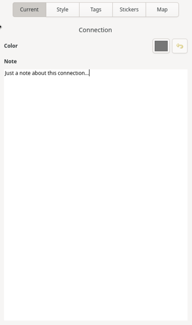

# Connection Properties Sidebar

If the **Current** tab is active in the sidebar and a connection is selected in the mind-map, this tab will display the properties for the selected connection. Any changes made within this tab will be immediately visible within the mind-map canvas and automatically saved to file.

The following image is a representation of this tab when a connection is selected.

### Color

Clicking on the button will display a color picker dialog window. If a new color is selected, the color of the connection line and the box around the title text will be changed to the selected color.

The button to the right of the color picker will revert the color back to the theme's default connection color.

### Note

This field allows you to add any additional information about the connection that you would like to include. This text is searchable within the search feature, accessible from the header bar.
