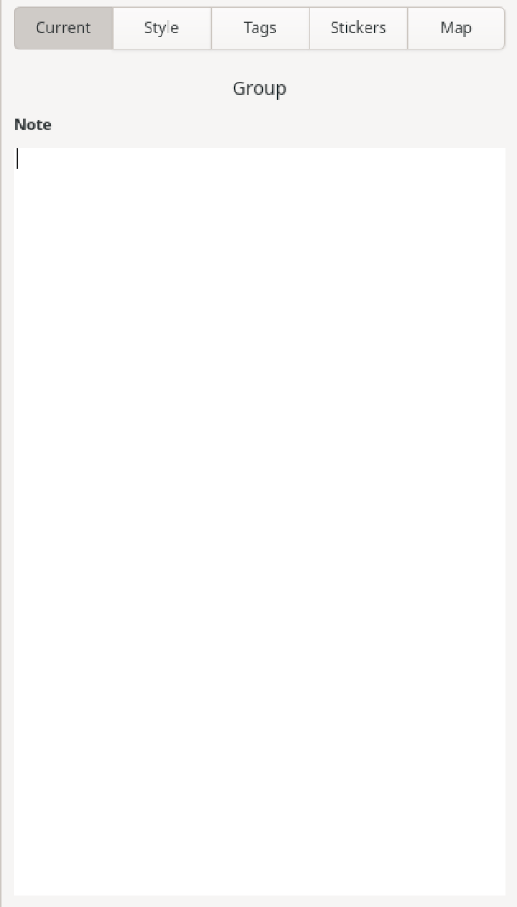

# Group Properties Sidebar

If the **Current** tab is active in the sidebar and a node group is selected in the mind-map, this tab will display the properties for the selected group. Any changes made within this tab will be immediately visible within the mind-map canvas and automatically saved to file.

The following image is a representation of this tab when a group is selected.

### Note

This field allows you to add any additional information about the group that you would like to include. This text is searchable within the search feature, accessible from the header bar.

More information on editing within the notes field can be found [here](Notes.md).
