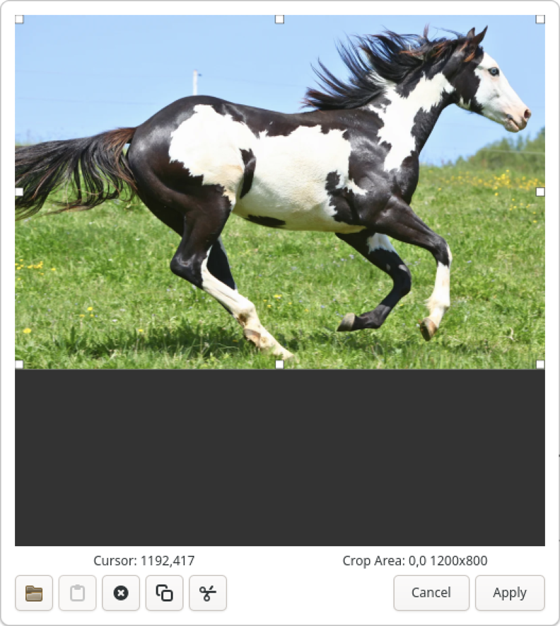

# Image Editor

The image editor allows images added to nodes to be changed, removed or cropped.  The following image is a depiction of this editor:

## Interface

The image editor is a simple window to two primary components.  The preview/crop displaying the current node's image with additional crop drag handles that allow you to remove area around the outside of the image that you do not want to show in the mind map.  Note that cropping an image only affects the view of the image in the mind map.  It does not change the image itself which means that you can, at any time, change the crop using the image editor by dragging any one of the eight drag handles.

To move the cropped area, simply click and drag anywhere in a "displayed" area of the image and drag the crop rectangle to your desired location.

You can see the X,Y position of the cursor within the image below the image along with the size of the cropped area (in pixels).

### Button Bar

At the bottom of the image editor are a series of buttons that allow you to change, remove or even copy the current image to the clipboard.  These buttons are as follows (from left to right).

#### Change Image

When clicked, the change image button will display a standard file browser dialog allowing you to select a different image in your file system to use within the image editor.

#### Paste Image

If you have an image currently copied to your clipboard, clicking on this button will paste the copied image into the image editor.

#### Remove Image

Clicking this button will remove the image from the image editor and the selected node.  It will also close the image editor window.

#### Copy Image

Clicking the copy image button will copy the current image to the clipboard.  Note that the copied image will not include the crop information.

#### Cut Image

Clicking the cut image button will have the effect of copying the current image to the clipboard and removing the current image from both the image editor and the currently selected node.

#### Cancel

Clicking the **Cancel** button will close the image editor without applying any changes made to the image within the image editor.

#### Apply

Clicking the **Apply** button will close the image editor, applying any changes made within the image editor to the currently selected node's image.  Note that any buttons in the image editor that remove the image will be automatically applied on clicking the button.  Note that all image edits are undoable with Minder by clicking the **Undo** button within the header bar.