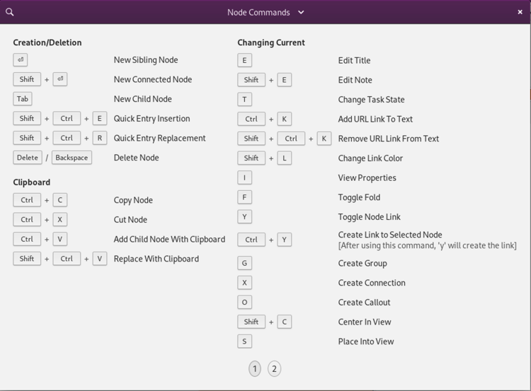
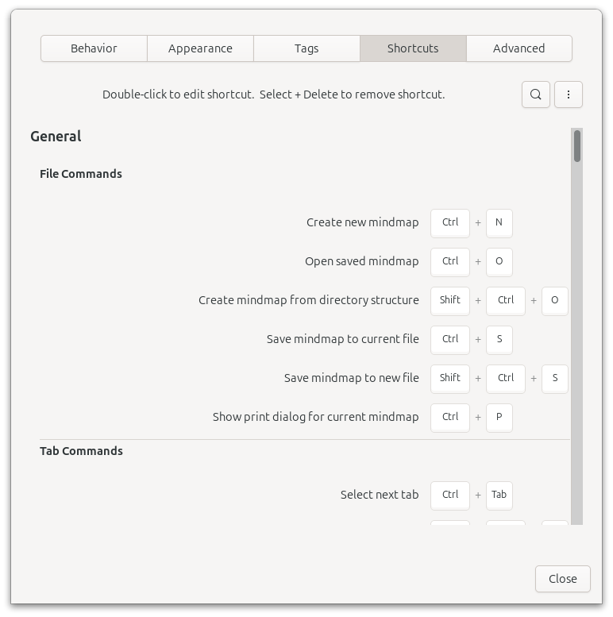

### Shortcuts Cheatsheet

All keyboard shortcuts will be accessible within the Minder **Shortcuts Cheatsheet** menu option available within the Preferences header bar button. It can also be displayed using the keyboard shortcut 'Control+?'.

Within the shortcuts cheatsheet window, you can perform a search or take a tour through the various contexts within the window. The cheatsheet is informational only, items within this window cannot be acted upon.

### Shortcuts in Tooltips

In addition to the shortcuts cheatsheet, keyboard shortcuts will also be shown when hovering over a UI element with an associated keyboard shortcut or displayed within any menus that contain actions to perform.

### Shortcut Preferences

Starting with Minder 2.0, shortcuts can be configured within the application preferences window in the Shortcuts Panel. All commands that can have shortcuts associated with them are displayed within this panel.

To edit a shortcut, double-click the current shortcut (or if the command doesn't offer a shortcut, double-click the "Disabled" area). When prompted, enter the keyboard shortcut combination you wish to use (keep in mind that for commands that can be executed in the mind-map area, you can use a single character to execute the command). Once the shortcut has been entered, it will be displayed in place of the previous shortcut. If the entered shortcut is currently being used by another command, that command will be displayed in the upper area of the Shortcuts panel. To remove a shortcut from a command, click the shortcut to remove once and hit the Delete or Backspace key to remove it. Changes to shortcuts are automatically saved and immediately applied within the application.

You can quickly search the list of shortcut commands using the search button at the top of the Shortcuts panel.

If you would like to return all the shortcuts to their defaults, click on the "..." button in the panel to display a dropdown menu of features and select the "Set Minder Defaults" option. To clear all commands of their shortcuts to start fresh, select the "Clear All Shortcuts" option in the same menu.