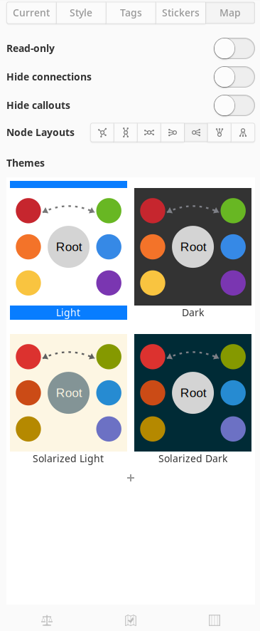
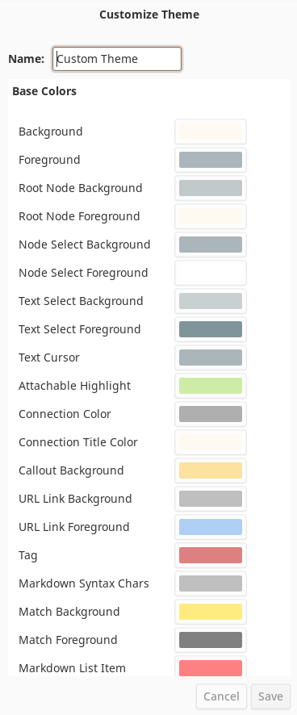

The map sidebar properties panel exists in the sidebar and provides quick access to functions that affect the entire mind-map. This panel can be accessed by displaying the sidebar with the right-most button in the header bar and then selecting the **Map** tab at the top of the sidebar.

The following is a representation of this panel:

Let's describe the parts of the sidebar in some detail.

#### Read-only

Enabling this switch will change the state of the mindmap to be readonly, disallowing any changes to the mindmap that would change the associated .minder file. Disabling this will allow the mindmap to be edited again. If the associated .minder file has readonly permissions on the file or if the .minder file was created by a version of Minder older than 2.0 and the user selected to open the file as readonly, this option will be enabled and the control greyed out to eliminate the possibility of writing to the filesystem.

#### Hide Connections

Enabling this toggle will hide any connections in the current mindmap from view. The connections can be shown again by disabling the toggle.

#### Hide Callouts

Enabling this toggle will hide any callouts in the current mindmap from view. The callouts can be shown again by disabling this toggle.

#### Node Layouts

This list of selection buttons specify what type of automatic layout is in effect. To select a different layout, simply click the desired layout button. All current nodes will redisplay themselves using the given layout option. Layouts affect where children nodes are placed relative to their parents and siblings. Minder supports seven layout types:

| Layout Option | Description                                                                                                                                                                               |
| ------------- | ----------------------------------------------------------------------------------------------------------------------------------------------------------------------------------------- |
| Manual        | Nodes will not be automatically placed by Minder which allows the user to move the nodes into any location.                                                                               |
| Vertical      | Child nodes will be placed above or below their parent nodes. Vertical layouts can be automatically balanced with the **Balance Nodes** button at the bottom of the map panel.            |
| Horizontal    | Child nodes will be placed to the right or left of their parent nodes. Horizontal layouts can be automatically balanced with the **Balance Nodes** button at the bottom of the map panel. |
| To Left       | Child nodes will be placed to the left of their parent node.                                                                                                                              |
| To Right      | Child nodes will be placed to the right of their parent node.                                                                                                                             |
| Upwards       | Child nodes will be placed above their parent node.                                                                                                                                       |
| Downwards     | Child nodes will be placed below their parent node.                                                                                                                                       |

#### Node Alignment

When manual layout mode is selected, the node alignment controls will be displayed just below the node layout controls. These controls allow you to select multiple nodes and adjust the node layout to align the top, middle or bottom vertical points or the left, middle, or right horizontal points of the nodes. These controls are also available in the context menu in the mindmap when multiple nodes are displayed.

#### Themes

This section contains a number of selection buttons that will change the color scheme used in the canvas. To change the theme, simply select one from the list of available themes.

You can create your own custom theme from the current theme by clicking on the `+` button below the available themes (if you have several themes, you may need to scroll the theme list to the bottom to see this button). In the theme editor panel, you can give the new theme a name, adjust any of the provided colors and save it using the `Save` button at the bottom of the theme editor panel.

After a custom theme has been created, you can re-edit the theme at any time by double-clicking the theme, making the needed changes, and clicking the `Save` button.

Additionally, you can delete a custom theme by double-clicking the theme and clicking on the `Delete` button in the bottom-left corner of the theme editor panel.

#### Button Bar

This area contains buttons whose actions affect the entire contents of the mind map.

##### Balance Nodes

If the current layout is either the vertical or horizontal layout type, clicking this button will cause all of the children of the root nodes to be redrawn such that each side of the root node will be approximately the same size.

##### Fold Completed Tasks

Causes all nodes that are marked as tasks and are also marked as completed to be folded from view, helping to focus on uncompleted tasks in the canvas.

##### Unfold All Tasks

Clicking on this button will unfold all folded nodes within the canvas.