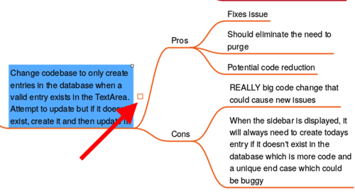
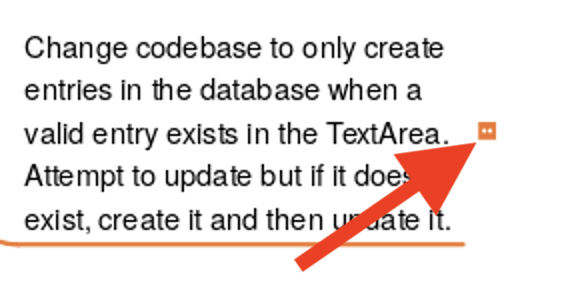

Just like a good outlining application or editor can allow you to hide portions of its content using disclosure triangles or code folding, Minder has the ability to hide child nodes of a given parent through a feature known as "node folding". Folding a node will hide the subtree of the node and display a node unfold box next to the root node of the hidden subtree. This box can be clicked to unfold the nodes and can serve as a reminder as to which nodes currently have hidden subtrees.

Let's take a closer look at how to use node folding without your document.

### Folding Nodes

To fold the subtree for a given node, select the node and click on the small box to the right of the selected node as seen in the following image. Alternatively, you can use the keyboard shortcut 'f' when the node is selected to fold a node. When the nodes have been folded, Minder will automatically reposition nodes in the tree to act as if those nodes didn't exist, making the mind map more compact. The following image shows the location of the node fold indicator:

### Unfolding Nodes

To undo the affect of a node fold, click on the resulting node unfold box as shown in the following image. This will display the hidden nodes as they were displayed prior to being folded. Alternatively, you may press the 'f' keyboard shortcut when the folded node is selected to do the same.

Note that when the cursor is hovered over the node unfold indicator, a tooltip will be displayed showing you the number of hidden child nodes along with the total number of nodes hidden by this fold.

### Folding Completed Tasks

For any nodes that are marked as tasks, Minder allows you to mark tasks as completed. If you would like completed tasks to be hidden via the fold mechanism, click on the "Fold Completed Tasks" button in the sidebar Map tab. Note that for folding to work in this context, all child nodes that are marked as tasks must be completed for all child nodes to be hidden via node folding.

### Deeply Unfolding Nodes

If a node has folded nodes and then afterwards you fold that node by folding an ancestor node, both folds will be remembered by Minder such that unfolding the ancestor node will only display its subtree before the fold took place. If you would like to perform a "deep unfold" where the entire subtree of the ancestor is unfolded, simply hold down the **Shift** key while clicking the unfold box (or use the keyboard shortcut 'Shift+F').

### Unfolding All Nodes

Minder has a button in the sidebar's Map tab and the bottom of the panel with the tooltip of "Unfold All Nodes". Use that to perform a deep unfold of the entire mind map. Note that unfolding can be undone using the "Undo" header bar button so if you want to revert the state of the mind map prior to the global unfold operation it can be done.