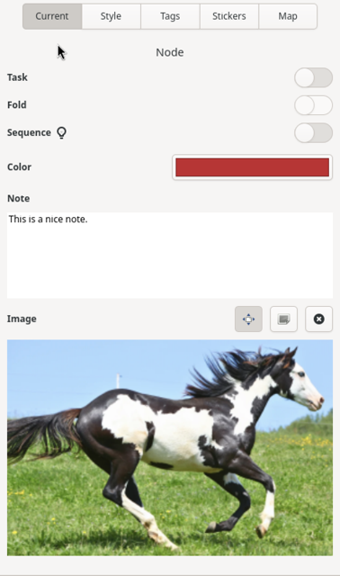

# Node Properties Sidebar

To view functionality and information about the currently selected node, select the **Current** tab at the top of the sidebar. This will allow you to quickly change any of the node properties for the currently selected node as well as access quick functions for the current node. All changes made in this panel will be immediately and automatically saved to the current document.

The following is a representation of this panel:

<u>Important Note:</u> If a node is not currently selected this panel will be blank.

### Task

The _Task_ toggle will cause the task functionality for the current node to be enabled or disabled. If a node is enabled as a task, the canvas will display a small circle to the left of the node text which can be clicked on using the mouse to indicate that the task has been completed or not. Hovering the mouse over a task circle will display the task completion percent for the given node.

### Fold

The _Fold_ toggle will cause all of the descendant nodes of the current node to be shown or hidden from view. If nodes are hidden from view, a small rectangle with two dots will be displayed to the right of the node to indicate that nodes are folded. To unfold a node within the canvas, simply click on the fold rectangle using the mouse to bring those nodes back into view.

### Sequence

If a node has children nodes that represent a sequence, selecting the _Sequence_ toggle will display the child nodes differently, including a sequence number for each child as well as drawing their links such that the first node’s link connects to the parent node while each subsequent child node’s link connects to the previous sibling node in the sequence. This drawing behavior change helps to identify these sequences within the map more easily. To revert back to the default child drawing behavior, select the parent node and deselect this option.

### Color

The _Color_ button displays the current color associated with the node and its parent-attached link. To change this color, click on the button. This will display a color chooser window. Simply select a color from this window and click the **Select** button to change the color.

### Note

The _Note_ text field allows the user to attach additional textual information to the node. If this field contains text, a special icon will be displayed to the right of the node text in the canvas. If this field is empty, the node icon in the canvas will be removed. You can display the note associated with the node as a tooltip by hovering the mouse pointer over a note icon.

More information about editing the notes field can be found [here](Notes.md).

### Image

The _Image_ area will either display a button to click on to add an image to the current node (if one doesn't currently exist) or it will display the current image as a thumbnail. To add an image, simply click on the **Add Image...** button which will display a standard file chooser. Choosing a file and clicking on the "Select" button will display the image in the sidebar and add an image to the node within the canvas.

Three buttons will be available above the image in the sidebar when an image is associated with the node. The left-most button is a toggle button that determines if the image is resized when the node is resized. The center button, if clicked, will allow the image to be edited in the [image editor](Image-Editor.md). The right button, if clicked, will remove the image from the current node, updating the canvas as well.

To associate a different image with a node, you can either remove it using the trash can icon, click on the edit button and change the image within the image editor, or you can drag and drop an image onto the current image to change it.
