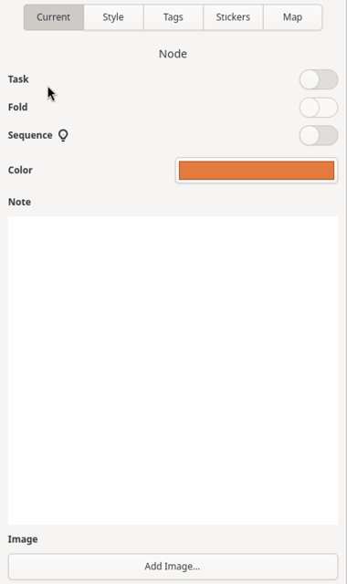

### Sidebar

The sidebar displays and exposes additional functionality about the currently selected node, connection, element styling or the mind-map itself. It is comprised of three tabbed panels:  Current, Style and Map.  By default, the sidebar is not displayed, allowing the canvas to be front and center. To display or hide the sidebar, click on the right-most header bar button or use the keyboard shortcut.

* [Current Properties Panel](Current-Sidebar.md)
* [Style Properties Panel](Style-Sidebar.md)
* [Tag Properties Panel](Tags-Sidebar.md)
* [Sticker Properties Panel](Adding-Stickers.md)
* [Map Properties Panel](Map-Sidebar.md)
