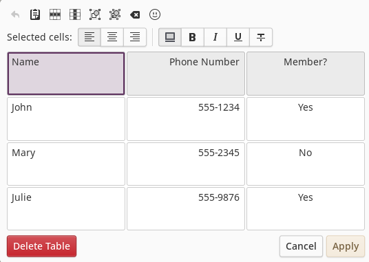

# Table Editor

The following image depicts the node table editor interface.

## Interface

The table editor interface consists of 4 main areas.

### Table Button Bar

The top-most row of buttons provide editing functions for the table.  These buttons are described as follows (from left to right):

#### Undo

Clicking this button undoes the last table editing operation within the current table editing window which includes text changes, formatting and structural changes.  Once the table editor interface is closed (with Cancel or Apply), the undo buffer is cleared.

#### Paste Table

If the clipboard contains tab-separated data copied from a spreadsheet or standard Markdown table text, the contents of the entire table will be replaced with the clipboard contents.

#### Row Actions

Clicking the Row Actions button displays a menu of functions that operate on the row containing the currently selected cell.  Menu options include:

* Insert row above the current row
* Insert row below the current row
* Move current row up by one
* Move current row down by one
* Delete the current row

#### Column Actions

Clicking the Column Actions button displays a menu of functions that operate on the column containing the currently selected cell.  Menu options include:

* Insert column before the current column
* Insert column after the current column
* Move current column left by one
* Move current column right by one
* Delete the current column

#### Merge Selection

If multiple cells are selected either by dragging across cells or shift-clicking two adjacent cells, clicking this button will merge the selected cells into a single cell.  The new cell will cross two or more rows and/or columns.

#### Split Selection

If a merged cell is selected, clicking this button will break the merged cell back into separate cells.

#### Clear Cells

Clicking this button will clear all text within the currently selected cells.

#### Insert Emoji

Clicking the emoji button will display the emoji picker.  Selecting an emoji will insert that emoji characters at the current insertion cursor.

### Cell Button Bar

The second row of buttons primarily affect the current selected cells.  The following is a description of each button (from left to right).

#### Column Justification

The first item in the button bar is a series of three mode buttons that determine how text is justified in the currently selected column.  Justification options are:  left, center or right.

#### Highlight Cells

This button toggles the highlight state of the currently selected cells.  Highlighted cells will be displayed with a different background color than non-highlighted cells.  This can be useful for depicting a header row, displaying even/odd rows, or just calling attention to a subgroup of cells in the table.

#### Bold Cells

This button toggles the bold state of the text of currently selected cells.  Bold style will be applied to all text within the cell.

#### Italicize Cells

This button toggles the italicized state of the text of currently selected cells.  Italicized style will be applied to all text within the cell.

#### Underline Cells

This button toggles the underlined state of the text of currently selected cells.  Underlined style will be applied to all text within the cell.

#### Strike-through Cells

This button toggles the strike-through state of the text of currently selected cells.  Strike-through style will be applied to all text within the cell.

### Table Cells

This is the main editing area of the interface, displaying all table cells, their text, and the currently selected cell state.  Selecting a single cell within the table will allow you to start immediately editing the text of the cell.  You can select a rectangular range of cells by dragging out the selection or shift-clicking cells.

### Table Editing Completion Buttons

The bottom row of buttons are labeled according to their function.

#### Delete Table

Removes the current table from the node and ends table editing mode.

#### Cancel

Ends table editing mode without applying any changes made within the table editor.

#### Apply

Ends table editing mode, applying any changes made within the table editor to the currently selected node.
