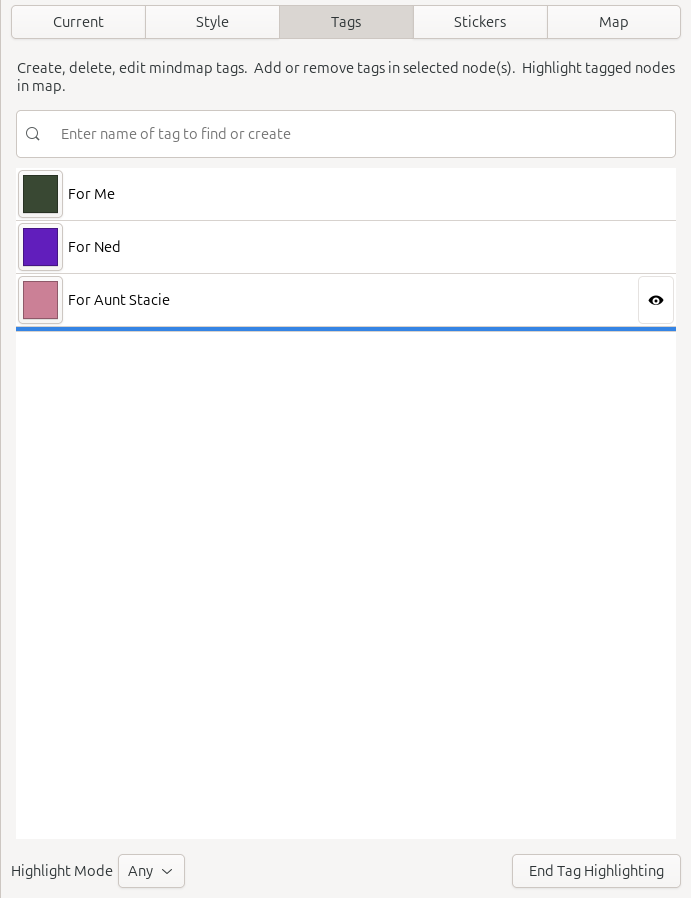

# Tags Sidebar Tab

Tags added to nodes provide additional context and allow nodes that do not have a parent-child relationship to be grouped together. When nodes are tagged, the user can easily see all nodes within a particular group or combination of groups by using the tag sidebar. Tags can also act as a filter in searching nodes, allowing you to search for nodes that have a given set of tags.

The tags sidebar displays the list of tags for the current mind map. Each mind map can have its own unique list of tags and those tags are stored in the corresponding .minder file.

### Creating Tags

To create a new tag, enter the name of tag in the entry field in the tags sidebar. As you type, the contents in the list of tags will change as entering text in this field performs also performs a search of tags that match the entered text. After the new tag name has been entered, hit the **Enter** key to create the tag. If one or more nodes are selected in the mind map when a new tag is created, these nodes will automatically have the tag added to them.

In addition to a name, a color will also be associated with the tag. Colors will be randomly chosen by Minder when the tag is created; however, if you would like to change the color, click on the color box. This will display a color picker UI. Select the new color and click the **Select** button to change the color of the tag. 

### Removing Tags

To remove a tag, simply select the tag in the tags sidebar list and hit the **Delete** or **Backspace** key. This will delete the tag from the list and it will remove that tag from any nodes that use it.

### Changing Tags In Nodes

To add an existing tag to one or more nodes, select the nodes in the mind map and then click on the name of the tag to add or remove. The status of the tag will be displayed on the right side of the tag with a checkbox. If the tag is included in the selected node(s), the checkbox will appear; otherwise, the checkbox will not be displayed.

### Searching Tags

If you have a large list of tags, use the entry field to search for tags containing the string of characters entered. The list of tags will only show tags matching the entered characters.

### Filtering Nodes With Tags

If you would like to see which nodes are tagged with a specific tag, go to the tag sidebar and select the "eye" button on the right-hand side of a tag. When this occurs two things will happen. First, the mind map will go into a special type of focus mode which will display only nodes that contain the given tag, fading out all other nodes. Second, the tag sidebar will change to display a button bar at the bottom of the panel. 

This "tag highlight" button bar contains two controls. The control on the left allows you to specify how tag matching should occur. It is a dropdown containing three values: *All*, *Any* and *None*. If *All* is selected and more than one tag is selected for viewing, only nodes containing all the selected tags will be displayed. If *Any* is selected and more than one tag is selected for viewing, nodes containing any of the selected tags will be displayed. If *None* is selected, only nodes containing none of the selected tags will be displayed.

The control on the right of the "tag highlight" button bar will automatically deselect all the "eye" indicators in the tag list, essentially ending tag highlight mode in the mind map. This is a convenience button as tag highlighting mode is ended when none of the "eye" buttons are enabled in the tag list which you can manually change in the list.

### Node Display in Mind Map

Nodes that contain tags are noted in the mind map by displaying the tag colors as a list of boxes in the node below the node text. All applied tags are shown. To see the list of applied tags for a given node, you can hover the mouse cursor over the tag area in the node. This will display the applied tags in a tooltip. Left-clicking the applied tags area will automatically change the sidebar to display the tags sidebar, allowing you to interact with the tags in that space as described above.

