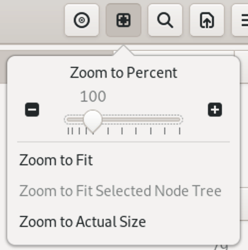

# Zooming

By default, Minder sets the zoom level to 100% which displays nodes and text at a size that is deemed to be easy to edit and work with; however, for mind maps that exceed the size of mind mapping canvas, it is often useful to zoom out or in to see more content or to focus on a portion of your data. For these purposes, Minder has support for mind map zooming via the **Zoom** button in the header bar.

### Manual Zoom

You can take control of the zoom level directly by using the zoom slider at the top of the zoom menu. Sliding the slider to the left will zoom out by increments of %25. Sliding the slider to the right will zoom in by increments of 25%. Alternatively, you can click on the minus and plus buttons on the left and right side of the slider to do the same. Finally, you can use the keyboard shortcuts of 'z' or 'Control+Minus" to zoom out and 'Z' or 'Control+Equal' to zoom in. When Minder zooms in or out, it will attempt to keep the center of the current view in the center of the new view.

### Zoom To Fit

If you want a way to quickly see the entire mind map within the current canvas, use the **Zoom To Fit** menu option (or use the keyboard shortcut 'Control+1'). This not only adjust the zoom level to be large enough to view the mind map but it will also place the mind map so that all its content will be in view.

### Zoom To Fit Selected Node Tree

If you want to zoom and view a portion of the mind map as determined by a single node, use the **Zoom To Fit Selected Node Tree** (or use the keyboard shortcut 'Control+2'). This will automatically adjust the zoom level to be large enough to display the selected subtree (where the currently selected node is the root of that subtree) and it will move the mind map to display the entirety of the subtree.

### Zoom To Actual Size

This menu option is a shortcut to quickly placing the zoom level back to the default of 100%. If the zoom level is larger or smaller than 100%, the current center of the canvas will remain in the center of the new view.

